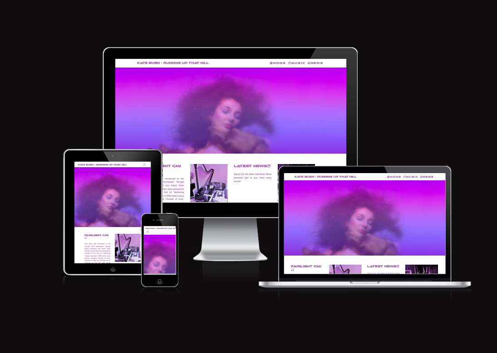

Readme.md 

# **KATE BUSH-RUNNING UP THAT HILL**

[Link to Live Project](https://codeconnoisseur74.github.io/Running-Up-That-Hill/)

## Table of Contents
- [Introduction](#introduction)
- [UX](#ux)
  - [User Stories](#user-stories)
  - [Wireframes](#wireframes)
- [Features](#features)
  - [Existing Features](#existing-features)
  - [Features Left to Implement](#features-left-to-implement)
- [Technologies Used](#technologies-used)
  - [Languages Used](#languages-used)
  - [Frameworks, Libraries & Programs Used](#frameworks-libraries--programs-used)
- [Testing](#testing)
- [Deployment](#deployment)
  - [GitHub](#github-pages)
  - [Forking the GitHub Repository](#forking-the-github-repository)
  - [Cloning the GitHub Repository](#cloning-the-github-repository)
- [Credits](#credits)
  - [Code](#code)
  - [Content](#content)
  - [Media](#media)
  - [Other](#other)

## Introduction

This is a website providing information about the brief history of artist and musician Kate Bush. This website focuses particularly on Kate's song "Running Up That Hill" which recently made music history by finally achieving nymber 1 status on the music charts after 37 years since it's release. This is due in huge part to the success of the Netflix series "Stranger Things" Season 4 which is also explained on this website. The website also briefly explains the history of how Kate begain using the Fairlight CMI Synthesizer, which hugely shaped her sound on this song and many others. This website is targeted to Kate Bush fans, but mostly to the new young fans she aquired through the sudden resurgence of the hit song. 

## UX

### User Stories

| ID | As a... | I Want To Be Able To... | So That I Can...|
| --- | --- | --- | --- |
| 01 | As a user,| I want to easily navigate the website, | so my time isn't wasted. |
| 02 | As a young user | I want to quickly understand what the site is all about, | so that I can decide if it is of interest to me. |
| 03 | As a longtime Kate Bush fan,| I want to ensure that the site is esthetically pleasing | quick access to any newsletter info.|

## Features

### Existing Features

#### Name of feature

* Description of feature and benefit
* Description of feature and benefit

#### Name of feature

* Description of feature and benefit
* Description of feature and benefit

### Features Left to Implement

* Describe some features that we would like to implement in the future

## Technologies Used

### Languages Used
* [HTML5](https://en.wikipedia.org/wiki/HTML5), [CSS3](https://en.wikipedia.org/wiki/CSS), [JavaScript](https://en.wikipedia.org/wiki/JavaScript), [Bootstrap5](https://en.wikipedia.org/wiki/Bootstrap_(front-end_framework))  

### Frameworks, Libraries & Programs Used

* [Bootstrap 5.2](https://getbootstrap.com/docs/5.2/getting-started/introduction/) has been used to assist with the styling of the site and particularly the responsiveness.
## List other frameworks we have used
* [Adobe Fonts](https://www.adobe.com/products/catalog.html)
* [Favicon](https://favicon.io/)
* [Fontawesome](https://fontawesome.com/)

## Testing

Details about the testing we have carried out.

## Deployment

### GitHub Pages

The project was deployed to GitHub Pages. The following steps are used to deploy the site:
* Navigate to GitHub and locate and select the GitHub repository.
* Navigate to the settings tab and select the 'Pages' tab from the menu.
* Under 'Source' click the dropdown labelled 'None' and select the 'master' branch.
* Click save. The page will automatically refresh and the published site link can be found on the 'Pages' tab.
* The link can be found here - link to live site

### Forking the GitHub Repository

The following steps can be used to fork the GitHub repository:
* On GitHub navigate to the main page of the repository.
* The 'Fork' button can be found on the top righthand side of the screen.
* Click the button to create a copy of the original repository.

### Cloning the GitHub Repository

The following steps can be used to clone the GitHub repository:
* On GitHub navigate to the main page of the repository.
* Above the list of files select 'Code'.
* Three options are provided, HTTPS, SSH and GitHub CLI. Select the appropriate option and click the 'Copy' button next to the URL.
* Open Git Bash.
* Change the working directory to the location for the cloned directory.
* Type git clone and paste the copied URL.
* Press 'Enter' to create the clone.

## Credits

### Code

* Credit and articles etc that we have copied code from

### Content
* credit fonts and font awesome icons etc
* Credit and sites we have taken information from

### Media
* Credit images used

### Other

* Any other credits
